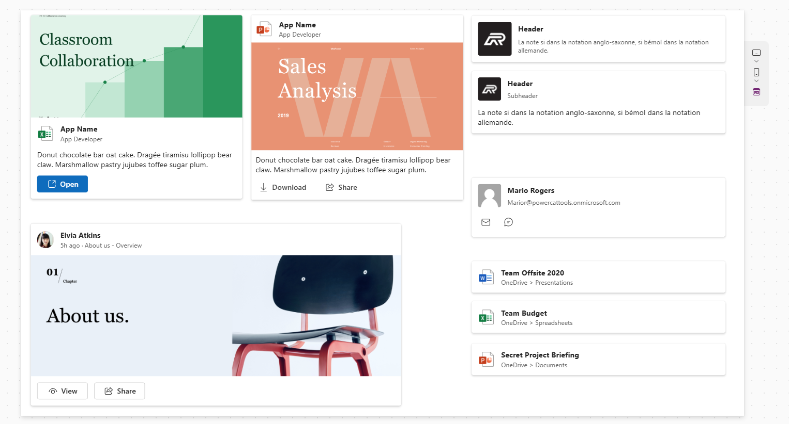

# Card Component

This Card component, built using Fluent UI v9, provides a versatile layout and toolbar for various applications in canvas and custom pages.

| Canvas apps | Custom pages | Model-driven apps | Portals |
| ----------- | ------------ | ----------------- | ------- |
| ✅           | ✅            | ⬜                 | ⬜       |

## Card Preview



## Configuration

The component accepts the following properties:

### Basic Properties

- **AccessibleLabel** - A label for accessibility, useful for screen readers.
- **Title** - The main title displayed on the card.
- **Subtitle** - A subtitle displayed under the title.
- **Description** - A descriptive text area to provide more context about the card.
- **HeaderImage** - An optional image displayed in the card header.
- **Image** - An additional image for the card's body.
- **ImagePlacement** - Specifies where to place the `Image` in relation to the header. Possible values:
  - **Above header** - Image appears above the header.
  - **Below header** - Image appears below the header.

### Layout Properties

- **Size** - Sets the size of the card. Note that this option adds spacing between elements inside the card. Available options are:
  - **Small**
  - **Medium**
  - **Large**
- **Alignment** - Controls the alignment of the card content:
  - **Vertical**
  - **Horizontal**
- **AutoHeight** - Dynamically adjusts the height of the card based on content.

### Toolbar Properties (Action Items)

This component supports a customizable toolbar that can include action items, configured through the `Items` property.

- **Items** - A collection of action items to be displayed in the toolbar. Each item has:
  - **ItemDisplayName** - The display name of the item.
  - **ItemKey** - A unique key identifying the item.
  - **ItemDisabled** - A flag indicating if the item should be disabled.
  - **ItemVisible** - A flag to toggle the visibility of the item.
  - **ItemIconName** - The name of the icon to display with the item.
  - **ItemIconStyle** - Specifies the style of the icon (e.g., "Regular").
  - **ItemAppearance** - Sets the appearance of the item, such as its style or color.
  - **ItemTooltip** - Provides additional information about the item when hovered.

### Style and Accessibility

- **TabIndex** - Determines the tabbing order for accessibility.
- **Tooltip** - Provides additional information about the card when hovered.

### Common Properties

- **Height** - Controls the height of the card.
- **Width** - Controls the width of the card.
- **OnSelect** - An event triggered when an item in the toolbar is selected or a card is selected.

**Note:** The card can only be selected if there are no items (buttons) in the toolbar or if only one button is configured.

### Example Usage

Here’s how to set up a basic instance of the Card component with sample toolbar items. Paste below YAML after importing the Card code component.

```yaml
- Card_1:
    Control: cat_PowerCAT.Card
    Variant: pcfdataset
    Properties:
      OnSelect: =Notify(Self.Selected.ItemKey);
      Alignment: ='PowerCAT.Card.Alignment'.Vertical
      Description: =
      HeaderImage: =User().Image
      Items: |-
        =Table({ItemKey: "mail", ItemDisplayName: "", ItemIconName: "Mail", ItemAppearance:"Transparent", ItemVisible:true, ItemDisabled:false, ItemIconStyle: "Regular", ItemTooltip: "Send mail"},{ItemKey: "chat", ItemDisplayName: "", ItemAppearance:"Transparent",ItemIconName: "Chat", ItemIconStyle: "Regular",ItemTooltip: "Chat"})
      Size: ='PowerCAT.Card.Size'.Medium
      Subtitle: =User().Email
      Title: =User().FullName
      Width: =480
      X: =851
      Y: =317

