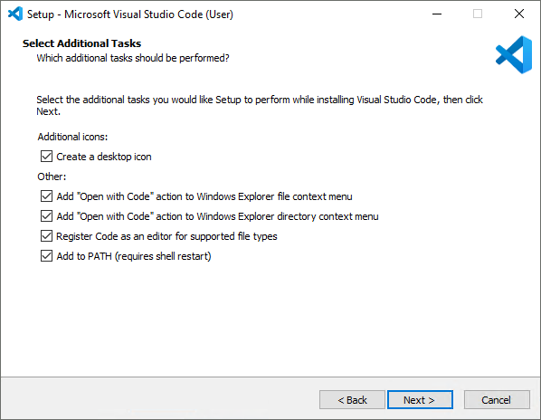
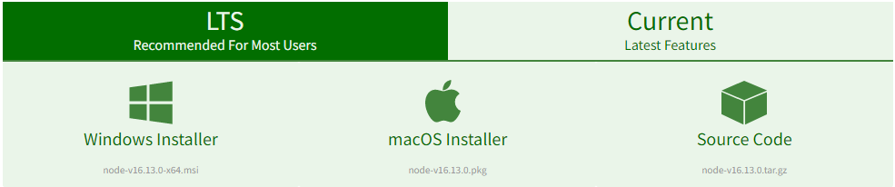
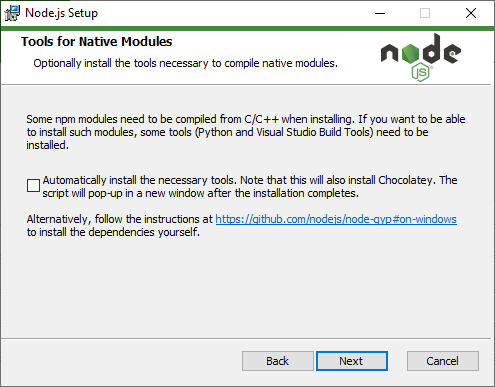
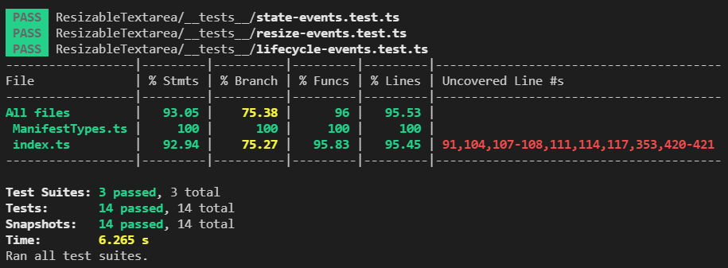
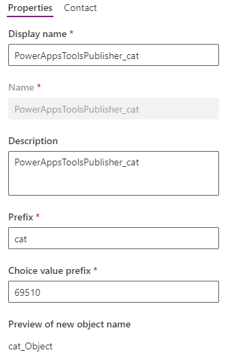

# Power CAT code components

The Power CAT code components are a set of Power Apps component framework (PCF) controls that can be used to enhance power apps.

These code components are available as part of Creator-Kit and can be downloaded from [latest release](https://github.com/microsoft/powercat-creator-kit/releases).

There are two types of components:

- **User interface components** - controls that have a user interface and are styled using properties.
- **Utility components** - controls that have no user interface, but provide functionality such as keyboard shortcut handling.

The following table provides an index to the code components in this repository:

| Code component                           | Type           | Overview                                                     | Fluent UI | Canvas apps | Custom pages | Model-driven apps | Power Apps Portal |
| ---------------------------------------- | -------------- | ------------------------------------------------------------ | --------- | ----------- | ------------ | ----------------- | ----------------- |
| [Auto width label](AutoWidthLabel)       | User interface | This code component acts similar to the standard canvas app label, but will expand dynamically in width to accommodate the text. This functionality is currently not supported in canvas apps today. | ⬜         | ✅           | ✅            | ⬜                 | ⬜                 |
| [Breadcrumb](Breadcrumb)                 | User interface | This code component provides a wrapper around the [Fluent UI Breadcrumb](https://developer.microsoft.com/en-us/fluentui#/controls/web/breadcrumb) control for use in canvas & custom pages. | **✅**     | **✅**       | **✅**        | ⬜                 | ⬜                 |
| [Calendar](Calendar)                 | User interface | This code component provides a wrapper around the [Fluent UI Calendar](https://developer.microsoft.com/en-us/fluentui#/controls/web/calendar) control for use in canvas & custom pages. | **✅**     | **✅**       | **✅**        | ⬜                 | ⬜                 |
| [Command Bar](CommandBar)                | User Interface | This code component provides a wrapper around the [Fluent UI Command Bar](https://developer.microsoft.com/en-us/fluentui#/controls/web/commandbar) control for use in canvas & custom pages. | **✅**     | **✅**       | **✅**        | ⬜                 | ⬜                 |
| [Context Menu](ContextMenu)              | User Interface | This code component provides a wrapper around the [Fluent UI Context Menu](https://developer.microsoft.com/en-us/fluentui#/controls/web/contextualmenu) control bound to a button for use in canvas & custom pages. | **✅**     | **✅**       | **✅**        | ⬜                 | ⬜                 |
| [DetailsList](DetailsList)               | User Interface | The DetailsList code component allows using of the [Fluent UI DetailsList component](https://developer.microsoft.com/en-us/fluentui#/controls/web/detailslist) from inside canvas apps and custom pages. | **✅**     | **✅**       | **✅**        | ⬜                 | ⬜                 |
| [Elevation](Elevation)                   | User Interface | Fluent UI elevation support with mouse hover events.         | **✅**     | **✅**       | **✅**        | ⬜                 | ⬜                 |
| [Facepile](Facepile)                 | User interface | This code component provides a wrapper around the [Fluent UI Facepile](https://developer.microsoft.com/en-us/fluentui#/controls/web/facepile) control for use in canvas & custom pages. | **✅**     | **✅**       | **✅**        | ⬜                 | ⬜                 |
| [Icon](Icon)                             | User Interface | Fluent UI [Font Icon](https://developer.microsoft.com/en-us/fluentui#/controls/web/icon)/ Icon Button & Action Button with custom styling. | ✅         | ✅           | ✅            | ⬜                 | ⬜                 |
| [Keyboard shortcuts](KeyboardShortcuts)  | Utility        | Registers key press event handlers to allow keyboard short cuts to be used inside canvas apps. | ⬜         | **✅**       | ⬜            | ⬜                 | ⬜                 |
| [Nav](Nav)                               | User Interface | This code component provides a wrapper around the [Fluent UI Nav Menu](https://developer.microsoft.com/en-us/fluentui#/controls/web/nav) control bound to a button for use in canvas & custom pages. | **✅**     | **✅**       | **✅**        | ⬜                 | ⬜                 |
| [PeoplePicker](PeoplePicker)                         | User Interface | [Fluent UI PeoplePicker control](https://developer.microsoft.com/en-us/fluentui#/controls/web/peoplepicker) for use in canvas & custom pages. | ✅         | ✅           | ✅            | ⬜                 | ⬜                 |
| [Persona](PeoplePicker)                         | User Interface | [Fluent UI Persona control](https://developer.microsoft.com/en-us/fluentui#/controls/web/persona) for use in canvas & custom pages. | ✅         | ✅           | ✅            | ⬜                 | ⬜                 |
| [Picker](Picker)                         | User Interface | Fluent UI Tag Picker support with custom item styling to allow for color/icons tags. | ✅         | ✅           | ✅            | ⬜                 | ⬜                 |
| [ProgressIndicator](ProgressIndicator)               | User Interface | The DetailsList code component allows using of the [Fluent UI ProgressIndicator component](https://developer.microsoft.com/en-us/fluentui#/controls/web/progressindicator) from inside canvas apps and custom pages. | **✅**     | **✅**       | **✅**        | ⬜                 | 
| [Pivot](Pivot)                           | User Interface | This code component wraps the [Fluent Pivot control](https://developer.microsoft.com/en-us/fluentui#/controls/web/pivot) for use in canvas & custom pages. | **✅**     | **✅**       | **✅**        | ⬜                 | ⬜                 |
| [Resizable text area](ResizableTextarea) | User interface | A text area control that can be resized by the user using handle on the bottom right corner. Can be styled to look like either the classic, fluent or model-driven text field controls. | ⬜         | **✅**       | **✅**        | **✅**             | ⬜                 |
| [SearchBox](SearchBox)                       | User Interface | [Fluent UI SearchBox control](https://developer.microsoft.com/en-us/fluentui#/controls/web/searchbox) for use in canvas & custom pages. | **✅**     | **✅**       | **✅**        | ⬜                 | ⬜                 |
| [Shimmer](Shimmer)                       | User Interface | This code component wraps the [Fluent Shimmer control](https://developer.microsoft.com/en-us/fluentui#/controls/web/shimmer) for use in canvas & custom pages. | **✅**     | **✅**       | **✅**        | ⬜                 | ⬜                 |
| [Spinner](Spinner)                           | User Interface | This code component wraps the [Fluent Spinner control](https://developer.microsoft.com/en-us/fluentui#/controls/web/spinner) for use in canvas & custom pages. | **✅**     | **✅**       | **✅**        | ⬜                 | ⬜                 |
| [SubwayNav](SubwayNav)                           | User Interface |  | **✅**     | **✅**       | **✅**        | ⬜                 | ⬜                 |
| [TagList](TagList)                       | User Interface | This code component provides a Tag List that provides flexible width rendering bound to a collection. | **✅**     | **✅**       | **✅**        | ⬜                 | ⬜                 |

## Building & Deploying

You may want to build and deploy the components using your own solution publisher. You can follow the steps below to build an deploy each code component to your environment so that it can then be added to your unmanaged solution for deployment, ideally as a managed solution.

First, you will need to decide on which solution publisher prefix you want to use. This is very important since once deployed, a code component cannot be changed to a different solution publisher prefix.

### Pre-Requisites

To build and deploy the Resizable Text Area control you will first need to install the pre-requisites:

1. [Visual Studio Code (VSCode)](https://code.visualstudio.com/Download) 
   - Ensure the Add to PATH option is selected:  
     

2. [node.js](https://nodejs.org/en/download/)
   - Installing the LTS (long term support) version is recommended:  
     
   - You **do not** need to check the **Automatically install the necessary tools** option on the **Tools for Native Modules** step:  
     

3. [Microsoft Power Platform VS Code extension](https://docs.microsoft.com/en-us/powerapps/developer/data-platform/powerapps-cli#using-power-platform-vs-code-extension)
   1. Open Visual Studio Code (VSCode).
   2. Select **Extensions** icon from the **Activity** panel (`Ctrl+Shift+X`).
   3. In the search bar, enter **Power Platform Tools**.
   4. Select **Install**. Once the installation is finished, restart your Visual Studio Code to see the extension within the **Terminal** window.
4. The [.NET 5.x SDK](https://dotnet.microsoft.com/download/dotnet/5.0) - Select the most appropriate version for your development workstation. 
   **Important:** If you have any existing VSCode terminal sessions open, you must close them before the dotnet sdk will be available.

### Unit Testing the code components with code coverage

Each code component has a set of unit-tests that can be run from inside VS Code:

```shell
npm run test
```

This will run the unit tests and report any failing tests, and the code-coverage metrics.
E.g.  


The target coverage is the default 80%.

### Building and Linting the code components

To build and lint the code component locally you can use:

```shell
npm run build
```

This will first fix any auto-fixable linting issues (reporting others as warnings), and then re-build the code component. If there are any build errors, they will be reported.

You can also, build in watch mode to test using the test-harness using:

```shell
npm start watch
```

You can run the linter using:

```shell
npm run lint:fix
```

### Deploying to your environment as an unmanaged component

1. First authenticate against your environment using:

   ```shell
   pac auth create -u <YourOrgUrl>
   ```

   E.g.

   ```shell
   pac auth create -u https://org42901917.api.crm4.dynamics.com
   ```

2. Deploy the code components using the the correct publisher prefix. This must match the publisher prefix of the solution that you want to add the code component into before exporting into a different environment.

   ```shell
   pac pcf push -pp <YourPublishPrefix>
   ```

   E.g.

   ```shell
   pac pcf push -pp cat
   ```

   In the above example, your solution publisher would need the publisher prefix of `cat`: 
   
   
3. Each time you deploy, you will need to increment the build (3rd component) of the control version in the `ControlManifest.Input.xml` file.

More information : [Code component application lifecycle management](https://docs.microsoft.com/en-us/powerapps/developer/component-framework/code-components-alm)

### Deploying to your environment as a managed solution

You can build and package the code component as a managed solution directly if required using a [Solution Project](https://docs.microsoft.com/en-us/powerapps/developer/component-framework/import-custom-controls).
More information - https://docs.microsoft.com/en-us/powerapps/developer/component-framework/import-custom-controls

### Testing checklist

This list contains the aspects that should be tested for each component:

1. Run-time behavior vs maker studio behavior
2. Custom Pages vs Canvas Apps behavior
3. Accessibility - tab order & aria labels
4. Dynamic sizing behavior using responsive containers
5. Upgrade experience when components are updated
