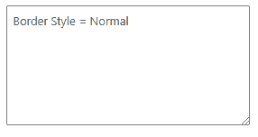
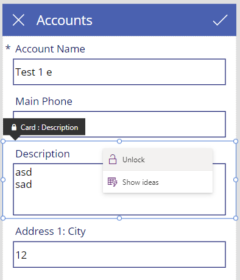
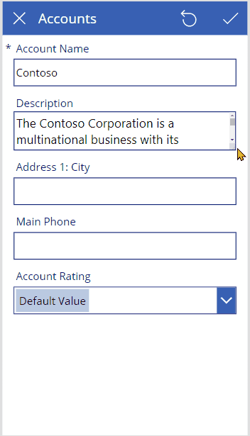
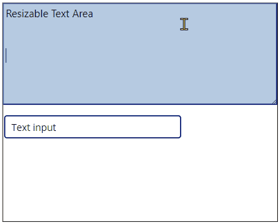
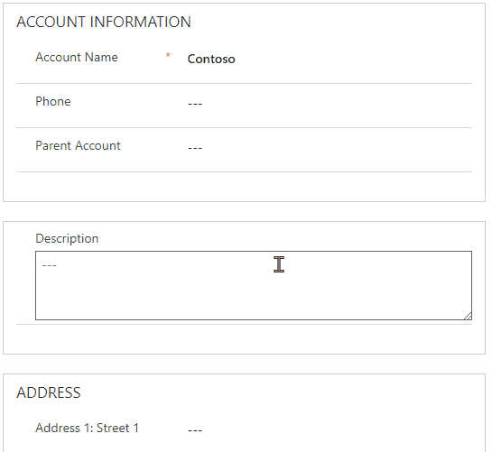

# Resizable Text Area code component

This code component provides a text area control that can be resized by the user using handle on the bottom right corner. It can be bound to a `SingleLine.Text`, `SingleLine.TextArea` or `Multiple` typed column.

| Canvas apps | Custom pages | Model-driven apps | Portals |
| ----------- | ------------ | ----------------- | ------- |
| ✅           | ✅            | ✅                 | ⬜       |

## Configuration

The control accepts the following properties:

### Text Properties

- **Text** - The text value set in the control. This is the default bound property when used in a model-driven app.
- **Default** - The default value that the control will have when the control is reset, or the default value is changed. This allows the control to work in a similar way to controls inside canvas app forms. 
- **Max Length** - The maximum number of characters that can be entered
- **Hint Text** - The text to display when there is no text value set
- **Empty Placeholder Text** - The text to display when there is no value, and the control does not have focus. This provides a similar style when the model-driven text control that displays **---** when there is no value populated.

### Style Properties

- **Padding Left** - The padding to add inside the `textarea`.

- **Padding Right** - The padding to add inside the `textarea`.

- **Padding Top** - The padding to add inside the `textarea`.

- **Padding Bottom** - The padding to add inside the `textarea`.

- **Left Padding Adjustment** - Inside a model driven app, even when the label is hidden there is padding on the left of the code component to hold icons (e.g. lock icon). To correct for this, the width must be reduced by setting the Left Padding Adjustment to 21. When there is also a label, the Left Padding Adjustment must be set to the width of the label.

- **Render Border Style** - This can be either **Normal** or Centered**.** When set to Normal, the border width will increase inside the text area box, however using **Centered** will center the border around the edge of the text area box. Use Centered to be compatible with the Power Apps **Classic** controls, and normal for model-driven and **Fluent UI** controls.

  | Render Border Style |                                                              |
  | ------------------- | ------------------------------------------------------------ |
  | Centered            |  |
  | Normal              |  |


### State Dependent Style Properties

Not all combinations of style/state are implemented by every component.
The Resizable text area has the following style properties:

|                 | Normal           | Hover                  | Focused                | Disabled              | Disabled : hover          |
| --------------- | ---------------- | ---------------------- | ---------------------- | --------------------- | ------------------------- |
| **Text Font**   |                  |                        |                        |                       |                           |
| Name            | Font Name        |                        |                        |                       |                           |
| Size            | Font Size        |                        |                        |                       |                           |
| Font size units | Font Size Units  |                        |                        |                       |                           |
| Color           | Font Color       | Hover Font Color       | Focus Font Color       | Disabled Font Color   |                           |
| Weight          | Font Weight      | Hover Font Weight      | Focus Font Weight      | Disabled Font Weight  |                           |
| **Hint Font**   |                  |                        |                        |                       |                           |
| Name            |                  |                        |                        |                       |                           |
| Size            |                  |                        |                        |                       |                           |
| Color           | Hint Font Color  |                        |                        |                       |                           |
| Weight          | Hint Font Weight |                        |                        |                       |                           |
| **Fill**        |                  |                        |                        |                       |                           |
| Color           | Fill Color       | Hover Fill Color       | Focus Fill Color       | Disabled Fill Color   | Disabled Hover Fill Color |
| **Border**      |                  |                        |                        |                       |                           |
| Color           | Border Color     | Hover Border Color     | Focus Border Color     | Disabled Border Color |                           |
| Thickness       | Border Thickness | Hover Border Thickness | Focus Border Thickness |                       |                           |
| Radius          | Border Radius    |                        |                        |                       |                           |
| Style           |                  |                        |                        |                       |                           |

### General Properties

- **Default Height** - The height to set the text area to initially.
  If this is not set in a canvas app/custom page, the size will default to the code component height.
  For model-driven apps, this is required since the form does not provide an initial height.
- **Default Width** - The width to set the text area to initially.
  If this is not set in a canvas app/custom page, the size will default to the code component height. 
  For model-driven apps, this is not required, since the default width will be the width of the form column.

- **Min Height** - The minimum height that the `textarea` can be resized to. Set to zero for no limit.
- **Max Height** - The maximum height that the `textarea` can be resized to. Set to zero for no limit.
- **Min Width** - The minimum width that the `textarea` can be resized to. Set to zero for no limit.
- **Max Width** - The maximum width that the `textarea` can be resized to. Set to zero for no limit.

- **Allow Resize** - Defines which direction the `textarea` can be resized in. None, Both, Vertical or Horizontal.
- **Enable Spell Check** - Defines if the `textarea` should be spell checked by the browser or not.

- **Accessibility Label** - The aria label
- **Input Event** - Set the Input Event property to a string starting in `SetFocus` to set focus on the control. You must include a random suffix for the event to trigger.
- **Resized Height** (output) - The user adjusted height
- **Resized Width** (output) - The user adjusted width

## Input Events

The Input Event property accepts a string that invokes various behaviors of the control. This is to simulate being able to call a custom method on a code component (e.g. `Reset(myComponent)` or `myComponent.SetFocus()`) which is not possible at this time.

To make calls to these input events, you can set a context variable that is bound to the Input Event property to a string that starts with `SetFocus` and followed by a random element to ensure that the app detects it as a change.

E.g.

```vb
UpdateContext({ctxResizableTextareaEvent:"SetFocus" & Text(Rand())}));
```

The context variable `ctxResizableTextareaEvent` would then be bound to the property `Input Event`

The following input events are accepted:

- `SetFocus` - Sets focus on the text area.
- `ResetSize` - Resets the size of the text area to the default size (or the component size if no default is provided)
- `ResetWidth` - Resets only the width part of the size
- `ResetHeight` - Resets only the height part of the size
- `ResetText` - Resets the text back to the Default value. This is similar to calling `Reset(TextInput)` which is not supported for code components.

## Example of use inside canvas app form

The resizable text area can be used to replace a standard text input inside a canvas app form component.

1. Create an app using the canvas app dataverse template, that allows adding/deleting/editing of **Accounts**. This template is a good starting point for a simple app, and uses the **Edit Form** control to add/edit records in dataverse.
2. Add the **Description** column to the Form Controls on **DetailScreen1** and **EditScreen1** using **Edit Fields** -> **Add Field**
3. Unlock the **Edit Form Card** named **Description_DataCard1** for the **Description** column on **EditScreen1**. We will replace the standard Text Input control with a resizable control.  
    
4. Remove the **Text Input**
5. Import the **Resizable Text Area** code component using **Get more components**.
6. Drag the **Resizable Text Area** component from the Insert pane into the card where the text input was.
6. Bind the following properties to enable the data card to use the default value for the Text Area, and then pick up the Text value when the form is being used for an update:
   1. `ResizableTextArea1.Width` = `Parent.Width - 60`
   1. `ResizableTextArea1.Height` = `100`
   1. `ResizableTextArea1.Default` = `Parent.Default`
   1. `ResizableTextArea1.AllowResize` = `Vertical`
   2. `ResizableTextArea1.MaxHeight` = `500` 
   3. `ResizableTextArea1.MinHeight` = `100`
   4. `Description_DataCard2.Update` = `ResizableTextarea1.Text`
   4. `ErrorMessage4.Y` = `ResizableTextarea1.Y + ResizableTextarea1.Height`
7. Bind the following properties to ensure that the Resizable Text Area is reset when the form is reset:
   1. `EditForm1.OnReset` = `UpdateContext({ctxResetText:"ResetText" & Text(Rand())});`
   2. `ResizableTextArea1.InputEvent` = `ctxResetText`
      **Note:** The random element is required to ensure that the change event is triggered.

9. Style the text area to look like the [classic controls](#style-to-look-like-classic-control) as required using the [styles below](#style-to-look-like-classic-control).  
   

## Example of use inside canvas app with responsive containers

There are two types of responsive layouts that can be implemented using the Resizable Text Area:

- **Manual Responsivity** - The `X`,`Y`, `Height` & `Width` properties of components are set using calculations based on the Screen `Width`/`Height` and the Resizable Text Area `ResizedWidth` & `ResizedHeight` properties.
- **Responsive Containers** - The Text Area is placed inside a responsive container, the width/height of which is controlled using the `ResizedWidth` & `ResizedHeight` properties. This then causes automatic re-flow of the surrounding components.

The simplest way to create a responsive app is to use the Responsive Container:

1. Add a new **Vertical Container** to a screen:

   1. `Direction` = `Vertical`
   2. `Vertical Overflow` = `Scroll`

2. Inside the Horizontal Container, add two Containers:

   1. `Flexible Height` = `Off`
   2. `Height` = `ResizableTextarea1.ResizedHeight` (This will resolve once the **Resizable Text Are**a is added below)

3. Inside the first Container, add a **Resizable Text Area**:

   1. `X` = `0`
   2. `Y` = `0`
   3. `Height` = `100` (This will be the initial default width)
   4. `Width`= `Parent.Width`

4. Inside the second Container, add a **Text Input** control.

5. Style the text area to look like the [classic controls](#style-to-look-like-classic-control) as required using the [styles below](#style-to-look-like-classic-control).  


## Example of using inside model-driven apps

The Resizable Text Area can be added to a model driven app to replace a standard Text or Multiline text field.

1. Open the form inside the Classic Editor

2. Locate the field that you wish to add the Resizable Text Area to

3. On the field **Properties** -> **Display** tab, uncheck **Disable label on the form**. This is so that the control occupies whole columns width. A section name can be used to provide name of the control. If the label is required, the Left Padding Adjustment property must be changed accordingly below since the `AllocatedWidth` context property provided to the code component via the context does not take this into consideration.

4. On the field **Properties** -> **Controls** tab, use **Add Control**, select the Resizable Text Area control, and then set the following properties:

   | Property                  | Value                                                        |
   | ------------------------- | ------------------------------------------------------------ |
   | Max Length                | Set to the maximum length of the column bound to the control |
   | Hint Text                 | Optional, e.g. 'Enter Description'. This will be shown when the control gains focus |
   | Empty Placeholder Text    | ---                                                          |
   | Default Height            | 200<br />This is the default height for the control before it is resized. |
   | Min Height                | 60                                                           |
   | Max Height                | 600                                                          |
   | Padding Left              | 7                                                            |
   | Padding Right             | 5                                                            |
   | Padding Top               | 5                                                            |
   | Padding Bottom            | 5                                                            |
   | Left Padding Adjustment   | 21<br />This is required to compensate for the `AllocatedWidth` property not taking the left padding for label and lock icon indicators into account. |
   | Allow Resize              | Vertical                                                     |
   | Enable Spell Check        | Yes                                                          |
   | Font Name                 | 'SegoeUI', 'Segoe UI'                                        |
   | Font Size                 | 14                                                           |
   | Fill Color                | rgb(255,255,255)                                             |
   | Disabled Hover Fill Color | rgb(226,226,226)                                             |
   | Border Color              | transparent                                                  |
   | Border Width              | 1                                                            |
   | Focus Border Color        | rgb(102,102,102)                                             |
   | Hover Border Color        | rgb(102,102,102)                                             |
   | Render Border Style       | Normal                                                       |

5. Set the **Resizable Text Area** as the default for the Web experience using the radio buttons.

6. **Save** and **Publish** the form.  


## Styling the Resizable Text Area

The following styles can be used to style the Resizable Text Area to look like native Power Apps controls.

### Style to look like a classic control

The following properties can be used to style the Text Area to look like the default classic text area

| Property                | Value            |
| ----------------------- | ---------------- |
| Empty Placeholder Text  |                  |
| Padding Left            | 12               |
| Padding Right           | 5                |
| Padding Top             | 5                |
| Padding Bottom          | 5                |
| Left Padding Adjustment | 0                |
| Font Name               | Open Sans        |
| Font Size               | 13               |
| Fill Color              | rgb(255,255,255) |
| Disabled Fill Color     | rgb(244,244,244) |
| Hover Fill Color        | rgb(186,202,226) |
| Border Color            | rgb(0,18,107)    |
| Border Width            | 1                |
| Focus Border Color      | rgb(102,102,102) |
| Hover Border Color      | rgb(102,102,102) |
| Disabled Border Color   | rgb(166,166,166) |
| Render Border Style     | Centered         |

### Style to look like a Fluent UI control

Use the following styles to make the Resizable Text Area look like a fluent ui control in custom pages.

| Property                | Value            |
| ----------------------- | ---------------- |
| Empty Placeholder Text  |                  |
| Padding Left            | 8                |
| Padding Right           | 8                |
| Padding Top             | 8                |
| Padding Bottom          | 8                |
| Left Padding Adjustment | 0                |
| Font Name               | Segoe UI         |
| Font Size               | 10.5             |
| Font Color              | rgb(66,66,66)    |
| Fill Color              | rgb(255,255,255) |
| Disabled Font Color     | rgb(209,209,209) |
| Disabled Fill Color     | rgb(245,245,245) |
| Border Color            | rgb(128,128,128) |
| Border Width            | 1                |
| Border Radius           | 2                |
| Focus Border Color      | rgb(0,120,212)   |
| Hover Border Color      | rgb(66,66,66)    |
| Hover border thickness  | 1                |
| Focus Border Width      | 2                |
| Disabled Border Color   | transparent      |
| Render Border Style     | Normal           |

### Style to look like a model-driven text control

Use the following styles to make the Resizable Text Area look like a model-driven text input.

| Property                  | Value                                                        |
| ------------------------- | ------------------------------------------------------------ |
| Empty Placeholder Text    | ---                                                          |
| Default Height            | 200<br />This is the default height for the control before it is resized. |
| Min Height                | 60                                                           |
| Max Height                | 600                                                          |
| Padding Left              | 7                                                            |
| Padding Right             | 5                                                            |
| Padding Top               | 5                                                            |
| Padding Bottom            | 5                                                            |
| Left Padding Adjustment   | 21<br />This is required to compensate for the `AllocatedWidth` property not taking the left padding for label and lock icon indicators into account. If the label is shown, this value will need increasing. |
| Allow Resize              | Vertical                                                     |
| Font Name                 | 'SegoeUI', 'Segoe UI'                                        |
| Font Size                 | 14                                                           |
| Fill Color                | rgb(255,255,255)                                             |
| Disabled Hover Fill Color | rgb(226,226,226)                                             |
| Border Color              | transparent                                                  |
| Border Width              | 1                                                            |
| Focus Border Color        | rgb(102,102,102)                                             |
| Hover Border Color        | rgb(102,102,102)                                             |
| Render Border Style       | Normal                                                       |

## Design challenges

The following are items of note that were encountered when creating this component:

#### Configurable pseudo styles 

Under many circumstances, code components have fixed or limited style capabilities. This code component has a large number of configurable styles similar to the native controls. Because of this, CSS pseudo styles for hover/focus/disabled cannot be used, and instead must be manually set using focus/mouse over events.

#### Centered vs inner border

The classics canvas app control borders work very differently to the Fluent UI and model-driven border styles. For this reason, the text area has to be wrapped in two `div` elements to allow centering of borders on the edge border box. See the note above on the **Render Border Style** property.

#### Two Option Properties

Some properties such as the **Enable Spell Check** property would be ideally set to a **TwoOptions** property type. This can be configured inside canvas apps and custom pages, however in model-driven apps, **TwoOptions** properties can only be bound to a field instead of a static value provided. Since a field would not normally exist on the form to bind this two, an `Enum` is created for this property and similar ones:

```xml
<property name="EnableSpellCheck" display-name-key="EnableSpellCheck" description-key="EnableSpellCheck_Desc" of-type="Enum" usage="input" default-value="1">
  <value name="No" display-name-key="No">0</value>
  <value name="Yes" display-name-key="Yes">1</value>
</property>
```

## Unsupported techniques

The following items are considered unsupported techniques at this time and will be removed once the platform allows:

#### Non-zero tab index in canvas apps

When canvas apps add html controls such as buttons and inputs to the DOM, it assigns a non-zero tabindex. E.g.:

```html
<button class="appmagic-button-container no-focus-outline" tabindex="15"...>
```

The result is that if html elements are added by code components without a non-zero tabindex assigned, they will not be set focus in the correct order when using keyboard tabbing.

To overcome this, there is an undocumented property that can be read inside the code component provided by the context:

```typescript
const assignedTabIndex = (context as any).accessibility?.assignedTabIndex ?? 0;
```

**Note:** The context is cast to any (or an extended Context type) to allow reading of the accessibility property.

This technique is not needed in model-driven apps, and the tabindex is not set on the textarea control.

#### Tooltips in canvas apps

When a code component is added to a canvas app, a tooltip can be set in the same way as a standard Label control. This tooltip cannot be read using the  standard documented types. Instead, an undocumented property can be used:

```typescript
const accessibleLabel = (context as any).accessibility?.assignedTooltip ?? "";
```

**Note:** The context is cast to any (or an extended Context type) to allow reading of the accessibility property.

