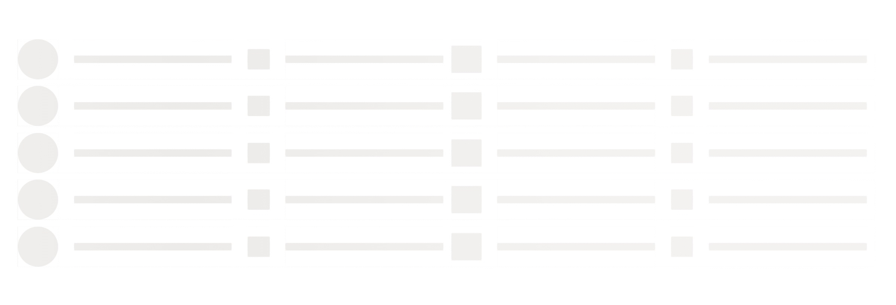

# Fluent Shimmer

This code component provides a wrapper around the [Fluent UI Shimmer](https://developer.microsoft.com/en-us/fluentui#/controls/web/shimmer) control bound to a button for use in canvas & custom pages.

| Canvas apps | Custom pages | Model-driven apps | Portals |
| ----------- | ------------ | ----------------- | ------- |
| ✅           | ✅            | ⬜                 | ⬜       |

## Configuration

The control accepts the following properties:

- **Items** - The action items to render
<<<<<<< HEAD
  - **ItemType** - The Shimmer element type from the list of three shimmer elements, i.e. cirlce, gap & line. 
=======
  - **ItemKey** - The key to use to indicate specific ShimmerElement. The keys must be unique.
  - **ItemType** - The Shimmer element type from the list of three shimmer elements, i.e. cirlce, gap & line. 
  - **ItemRowKey** - The key to use to indicate the RowKey and establish relationship.
>>>>>>> 48d69ffc393a155d03b3e7517eb7dc7512b10fd5
  - **ItemHeight** - Height of ShimmerElement.
  - **ItemWidth** - Width of ShimmerElement
  - **ItemVerticalAlign** - To specify how the element should align. i.e. 'top', 'center' or'bottom'.

<<<<<<< HEAD
- **RowCount** - Number of Shimmers to render
=======
- **Rows** - The action items to render
  - **RowKey** - The key to use to indicate specific Shimmer, and when adding sub items. The keys must be unique.
  - **RowOrder** - The order by which the Shimmer should render
  - **RowCount** - Number of Shimmers to render
  - **RowWidth** - Width of Shimmer
>>>>>>> 48d69ffc393a155d03b3e7517eb7dc7512b10fd5

- **SpacebetweenShimmer** - Space or Gap between each Shimmer incase of muliple rows.   

### Style Properties

- **Theme** - Accepts a JSON string that is generated using [Fluent UI Theme Designer (windows.net)](https://fabricweb.z5.web.core.windows.net/pr-deploy-site/refs/heads/master/theming-designer/). Leaving this blank will use the default theme defined by Power Apps.
- **AccessibilityLabel** - Screen reader aria-label

### Usage

<<<<<<< HEAD
Here is an example which can be used to create a Shimmer effect as shown in the below screen shot.
=======
Here is an example which can be used to create a Shimmer effect shown in the below screen shot.
>>>>>>> 48d69ffc393a155d03b3e7517eb7dc7512b10fd5



### Items Property value

<<<<<<< HEAD
Each Record in the below table can have following values.

|Property Name|Property Value|Required|
|--|--|--|
|ItemType|"circle"|Yes|
=======
Each Record in the below Table contains can have following values.

|Property Name|Property Value|Required|
|--|--|--|
|ItemKey|"1"|Yes|
|ItemType|"circle"|Yes|
|ItemRowKey|"1"|Yes|
>>>>>>> 48d69ffc393a155d03b3e7517eb7dc7512b10fd5
|ItemWidth|"20"||
|ItemHeight|10||


```
<<<<<<< HEAD
Table(
    {
        ItemWidth: "3.8",
        ItemHeight: 25,
        ItemType: "circle"
    },
    {
        ItemWidth: "5",
        ItemHeight: 10,
        ItemType: "gap"
    },
    {
        ItemWidth: "100",
        ItemHeight: 20,
        ItemType: "line"
    },
    {
        ItemWidth: "10",
        ItemHeight: 10,
        ItemType: "gap"
    },
    {
        ItemWidth: "100",
        ItemHeight: 20,
        ItemType: "line"
    })
=======
Table({ItemKey:"1",ItemWidth:"3.8",ItemHeight:60,ItemRowKey:"1",ItemType:"circle"},{ItemKey:"2",ItemWidth:"2",ItemHeight:10,ItemRowKey:"1",ItemType:"gap"},{ItemKey:"3",ItemWidth:"20",ItemHeight:10,ItemRowKey:"1",ItemType:"line"},{ItemKey:"4",ItemWidth:"2",ItemHeight:10,ItemRowKey:"1",ItemType:"gap"},{ItemKey:"5",ItemWidth:"2.8",ItemHeight:30,ItemRowKey:"1",ItemType:"line"},{ItemKey:"6",ItemWidth:"2",ItemHeight:10,ItemRowKey:"1",ItemType:"gap"},{ItemKey:"7",ItemWidth:"20",ItemHeight:10,ItemRowKey:"1",ItemType:"line"},{ItemKey:"8",ItemWidth:"1",ItemHeight:10,ItemRowKey:"1",ItemType:"gap"},{ItemKey:"9",ItemWidth:"3.8",ItemHeight:40,ItemRowKey:"1",ItemType:"line"},{ItemKey:"10",ItemWidth:"2",ItemHeight:10,ItemRowKey:"1",ItemType:"gap"},{ItemKey:"11",ItemWidth:"20",ItemHeight:10,ItemRowKey:"1",ItemType:"line"},{ItemKey:"12",ItemWidth:"2",ItemHeight:10,ItemRowKey:"1",ItemType:"gap"},{ItemKey:"13",ItemWidth:"2.8",ItemHeight:30,ItemRowKey:"1",ItemType:"line"},{ItemKey:"14",ItemWidth:"2",ItemHeight:10,ItemRowKey:"1",ItemType:"gap"},{ItemKey:"15",ItemWidth:"20",ItemHeight:10,ItemRowKey:"1",ItemType:"line"},{ItemKey:"16",ItemWidth:"1",ItemHeight:10,ItemRowKey:"1",ItemType:"gap"})
```
### Rows (rows_Items) Property value

Each Record in the below Table contains can have following values.

|Property Name|Property Value|Required|
|--|--|--|
|RowKey|"1"|Yes|
|RowOrder|1||
|RowCount|5||
|RowWidth|100||


```
Table(
    {
        RowKey: "1",
        RowOrder:1,
        RowCount:5,
        RowWidth: 100
    }
)
>>>>>>> 48d69ffc393a155d03b3e7517eb7dc7512b10fd5
```

### Example Theme

<<<<<<< HEAD
The following is an example of setting theme based on the output from the [Fluent UI Theme Designer (windows.net)](https://fabricweb.z5.web.core.windows.net/pr-deploy-site/refs/heads/master/theming-designer/). 
=======
The following is an example of setting the theme based on the output from the [Fluent UI Theme Designer (windows.net)](https://fabricweb.z5.web.core.windows.net/pr-deploy-site/refs/heads/master/theming-designer/). 
>>>>>>> 48d69ffc393a155d03b3e7517eb7dc7512b10fd5

```
Set(varThemeBlue, {
  palette: {
    themePrimary: ColorValue("#0078d4"),
    themeLighterAlt: ColorValue("#eff6fc"),
    themeLighter: ColorValue("#deecf9"),
    themeLight: ColorValue("#c7e0f4"),
    themeTertiary: ColorValue("#71afe5"),
    themeSecondary: ColorValue("#2b88d8"),
    themeDarkAlt: ColorValue("#106ebe"),
    themeDark: ColorValue("#005a9e"),
    themeDarker: ColorValue("#004578"),
    neutralLighterAlt: ColorValue("#faf9f8"),
    neutralLighter: ColorValue("#f3f2f1"),
    neutralLight: ColorValue("#edebe9"),
    neutralQuaternaryAlt: ColorValue("#e1dfdd"),
    neutralQuaternary: ColorValue("#d0d0d0"),
    neutralTertiaryAlt: ColorValue("#c8c6c4"),
    neutralTertiary: ColorValue("#a19f9d"),
    neutralSecondary: ColorValue("#605e5c"),
    neutralPrimaryAlt: ColorValue("#3b3a39"),
    neutralPrimary:ColorValue( "#323130"),
    neutralDark: ColorValue("#201f1e"),
    black: ColorValue("#000000"),
    white: ColorValue("#ffffff")
  }});

Set(varThemeBlueJSON,"{""palette"":{
  ""themePrimary"": ""#0078d4"",
  ""themeLighterAlt"": ""#eff6fc"",
  ""themeLighter"": ""#deecf9"",
  ""themeLight"": ""#c7e0f4"",
  ""themeTertiary"": ""#71afe5"",
  ""themeSecondary"": ""#2b88d8"",
  ""themeDarkAlt"": ""#106ebe"",
  ""themeDark"": ""#005a9e"",
  ""themeDarker"": ""#004578"",
  ""neutralLighterAlt"": ""#faf9f8"",
  ""neutralLighter"": ""#f3f2f1"",
  ""neutralLight"": ""#edebe9"",
  ""neutralQuaternaryAlt"": ""#e1dfdd"",
  ""neutralQuaternary"": ""#d0d0d0"",
  ""neutralTertiaryAlt"": ""#c8c6c4"",
  ""neutralTertiary"": ""#a19f9d"",
  ""neutralSecondary"": ""#605e5c"",
  ""neutralPrimaryAlt"": ""#3b3a39"",
  ""neutralPrimary"": ""#323130"",
  ""neutralDark"": ""#201f1e"",
  ""black"": ""#000000"",
  ""white"": ""#ffffff""
}
}");
```

The Theme JSON string is passed to the component property, whilst the varTheme can be used to style other standard components such as buttons using the individual colors.

For more information on the color palette to be used while working with Shimmer, refer **IShimmerColors Interface** section of [IShimmerElement](https://developer.microsoft.com/en-us/fluentui#/controls/web/shimmer#IShimmerElement) documentation.
