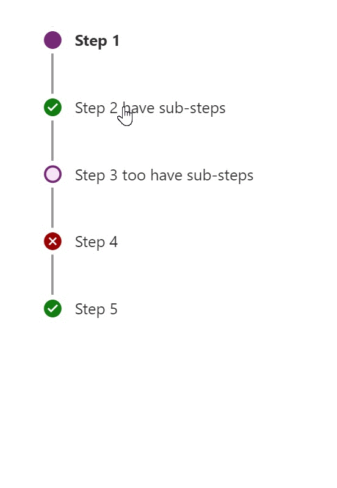

# SubwayNav

This code component provides a SubwayNav that allows you to visualize the steps required for a given wizard & it is bound to a collection.

| Canvas apps | Custom pages | Model-driven apps | Portals |
| ----------- | ------------ | ----------------- | ------- |
| ✅           | ✅            | ⬜                 | ⬜       |

## Glimpse of SubwayNav



## Configuration

The control accepts the following properties:

- **Items** - The action items to render
  - **ItemKey** - The key to use to indicate which item/step is selected. The keys must be unique.
  - **ItemLabel** - Label for the step
  - **ItemState** - Specifying the state of the step. Here is the list of State available. Current|NotStarted|Completed|Unsaved|ViewedNotCompleted|Error|CurrentWithSubSteps|Skipped|WizardComplete|Custom
  - **ItemIcon** - Will not do anything if ItemState isn't set to Custom. If ItemState is set to Custom, you can input the string value of any FluentUI Icon and it will show up. If the ItemIcon name is invalid, blank or doesn't match any FluentUI Icon's, then it will be set to same Icon as when ItemState is equal to Current. 
  - **ItemColor** - Will not do anything if ItemState isn't set to Custom. If ItemState is set to Custom, you can input most hexadecimal color codes and that will change the color of the Icon. If the input to this column is invalid, it will default to black. If the input to this column is blank, it will be set to the same color as when ItemState is equal to Current. 
- **SubwayNav state** - To mark the overall state of SubwayNav to Complete or Error.

### Style Properties

- **Theme** - Accepts a JSON string that is generated using [Fluent UI Theme Designer (windows.net)](https://fabricweb.z5.web.core.windows.net/pr-deploy-site/refs/heads/master/theming-designer/). Leaving this blank will use the default theme defined by Power Apps.
- **AccessibilityLabel** - Screen reader aria-label
- **ApplyDarkTheme** - Select in case Darktheme is used.

### Event Properties

- **InputEvent** - An event to send to the control. E.g. `SetFocus`. See below.

### Usage

Example of input collection value for Items property

```PowerFx
Table({ItemKey:"1",ItemLabel:"Step 1",ItemState:"Current"},
{ItemKey:"2",ItemLabel:"Step 2",ItemState:"Completed"},
{ItemKey:"3",ItemLabel:"Step 3",ItemState:"Unsaved"},
{ItemKey:"4",ItemLabel:"Step 4",ItemState:"ViewedNotCompleted"},
{ItemKey:"5",ItemLabel:"Step 5",ItemState:"Error"},
{ItemKey:"6",ItemLabel:"Step 6",ItemState:"WizardComplete"})
```

To get the selected step by the user, use the OnSelect or OnChange Property

Example code below

```PowerFx
Notify(Concatenate(Self.Selected.ItemLabel, " Selected & its status is ", Self.Selected.ItemState))
```

#### Example for Substep scenarios

Below is a sample item collection example that defines how substeps needs to be linked with main/parent step using ParentItemKey.

```PowerFx
Table({ItemKey:"1",ItemLabel:"Step 1",ItemState:"Current"},
{ItemKey:"2",ItemLabel:"Step 2 have sub-steps",ItemState:"WizardComplete"},
{ItemKey:"3",ItemLabel:"Sub Step 2.1",ParentItemKey:"2",ItemState:"Error"},
{ItemKey:"4",ItemLabel:"Sub Step 2.2",ParentItemKey:"2",ItemState:"WizardComplete"},
{ItemKey:"5",ItemLabel:"Sub Step 3.1",ParentItemKey:"8",ItemState:"ViewedNotCompleted"},
{ItemKey:"6",ItemLabel:"Sub Step 3.2",ParentItemKey:"8",ItemState:"Unsaved"},
{ItemKey:"7",ItemLabel:"Sub Step 3.2",ParentItemKey:"8",ItemState:"Unsaved"},
{ItemKey:"8",ItemLabel:"Step 3 too have sub-steps",ItemState:"Unsaved"},
{ItemKey:"9",ItemLabel:"Step 4",ItemState:"Error"},
{ItemKey:"10",ItemLabel:"Step 5",ItemState:"WizardComplete"})
```

### Output Schema

State of each item(Step) changes as we select or move to different step happens internally, especially the *Current* & *CurrentWithSubStep*. The current status can be determined using Output property called *Steps*.

Example code below

```PowerFx
Self.Steps

//Or

SubwayNav1.Steps
```

### Example Theme

The following is an example of setting the theme based on the output from the [Fluent UI Theme Designer (windows.net)](https://fabricweb.z5.web.core.windows.net/pr-deploy-site/refs/heads/master/theming-designer/).

```PowerFx
Set(varThemeBlue, {
  palette: {
    themePrimary: ColorValue("#0078d4"),
    themeLighterAlt: ColorValue("#eff6fc"),
    themeLighter: ColorValue("#deecf9"),
    themeLight: ColorValue("#c7e0f4"),
    themeTertiary: ColorValue("#71afe5"),
    themeSecondary: ColorValue("#2b88d8"),
    themeDarkAlt: ColorValue("#106ebe"),
    themeDark: ColorValue("#005a9e"),
    themeDarker: ColorValue("#004578"),
    neutralLighterAlt: ColorValue("#faf9f8"),
    neutralLighter: ColorValue("#f3f2f1"),
    neutralLight: ColorValue("#edebe9"),
    neutralQuaternaryAlt: ColorValue("#e1dfdd"),
    neutralQuaternary: ColorValue("#d0d0d0"),
    neutralTertiaryAlt: ColorValue("#c8c6c4"),
    neutralTertiary: ColorValue("#a19f9d"),
    neutralSecondary: ColorValue("#605e5c"),
    neutralPrimaryAlt: ColorValue("#3b3a39"),
    neutralPrimary:ColorValue( "#323130"),
    neutralDark: ColorValue("#201f1e"),
    black: ColorValue("#000000"),
    white: ColorValue("#ffffff")
  }});

Set(varThemeBlueJSON,"{""palette"":{
  ""themePrimary"": ""#0078d4"",
  ""themeLighterAlt"": ""#eff6fc"",
  ""themeLighter"": ""#deecf9"",
  ""themeLight"": ""#c7e0f4"",
  ""themeTertiary"": ""#71afe5"",
  ""themeSecondary"": ""#2b88d8"",
  ""themeDarkAlt"": ""#106ebe"",
  ""themeDark"": ""#005a9e"",
  ""themeDarker"": ""#004578"",
  ""neutralLighterAlt"": ""#faf9f8"",
  ""neutralLighter"": ""#f3f2f1"",
  ""neutralLight"": ""#edebe9"",
  ""neutralQuaternaryAlt"": ""#e1dfdd"",
  ""neutralQuaternary"": ""#d0d0d0"",
  ""neutralTertiaryAlt"": ""#c8c6c4"",
  ""neutralTertiary"": ""#a19f9d"",
  ""neutralSecondary"": ""#605e5c"",
  ""neutralPrimaryAlt"": ""#3b3a39"",
  ""neutralPrimary"": ""#323130"",
  ""neutralDark"": ""#201f1e"",
  ""black"": ""#000000"",
  ""white"": ""#ffffff""
}
}");
```

The Theme JSON string is passed to the component property, whilst the varTheme can be used to style other standard components such as buttons using the individual colors.


### Example using Custom Item State

Example of input collection value for Items property

```PowerFx
Table({ItemKey:"1",ItemLabel:"Step 1",ItemState:"Current"},
{ItemKey:"2",ItemLabel:"Step 2",ItemState:"Custom", ItemIcon:"Admin",ItemColor: "teal"},
{ItemKey:"3",ItemLabel:"Step 3",ItemState:"Custom",ItemIcon:"AddTo",ItemColor: "#EE82EE"})
```

You can use either the names of colors or the colors hexadecimal value. However, color hexadecimal value is recommended. If the color name isn't basic, it most likely won't work. 