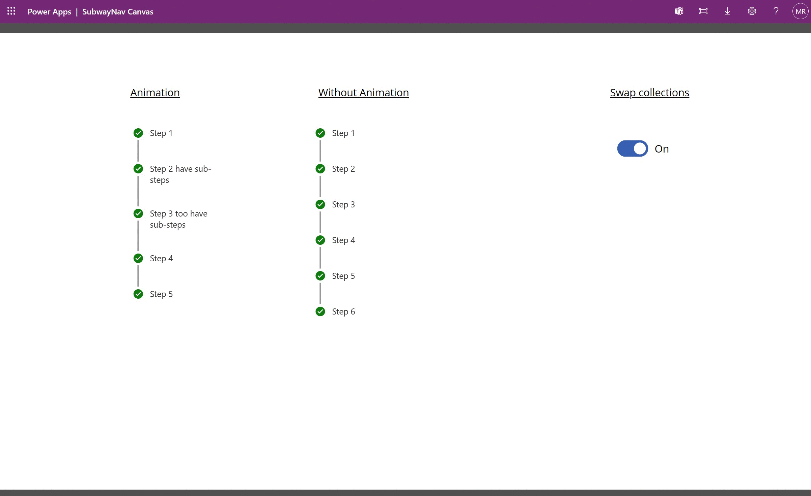

# Subway Nav new property - Show Animation

Subwaynav is primarily used in wizard based experience where user navigates through different steps of a process.
While the implementation of Subwaynav is fairly straight forward when there is a canvas app/ custom page with one screen, the appearance of it varies when used in different screen for each step, because of an animation it brings along with it during intial load or whenever the item collection is changed.

Inorder to disable the animation, a new property - Show animation is included, to give app makers an option to enable or disable the animation effect based on the requirement.

## Related changes are performed in file following files under this utility folder.

- subway-nav.types.ts
- subway-nav.tsx
- subway-nav-types.ts
- subway-nav-no-animation.styles.tsx

## Clip explaining purpose of this change

